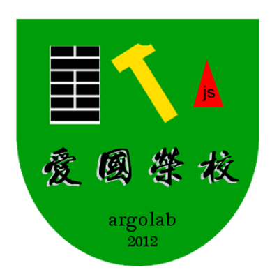

argolab的寄存网址

argolab是由中山大学逸仙时空BBS站务组系统维护员于2012年左右开启的外围组织。

启用新标识！（2019/07/06）
============

* 盾牌造型表示我们是立志于保护防卫型的组织。

* 屯卦画符表示网络安全任务的极端风险重要，我们必将全力以赴。

* 屯卦画符亦表示我们来自中国的文化，我们的文化是中华文化。

* 锤子画符表示我们我们是社会主义者，坚持社会主义是我们的底线。

* 三角形和js字符表示我们使用JavaScript以构建。

* 爱国荣校出自“中山大学学生准则”，是我们的工作导向和活动指引。

* argolab是我们的网络认别符。

* 2012表示我们最早2012年即已经开始展开活动。
